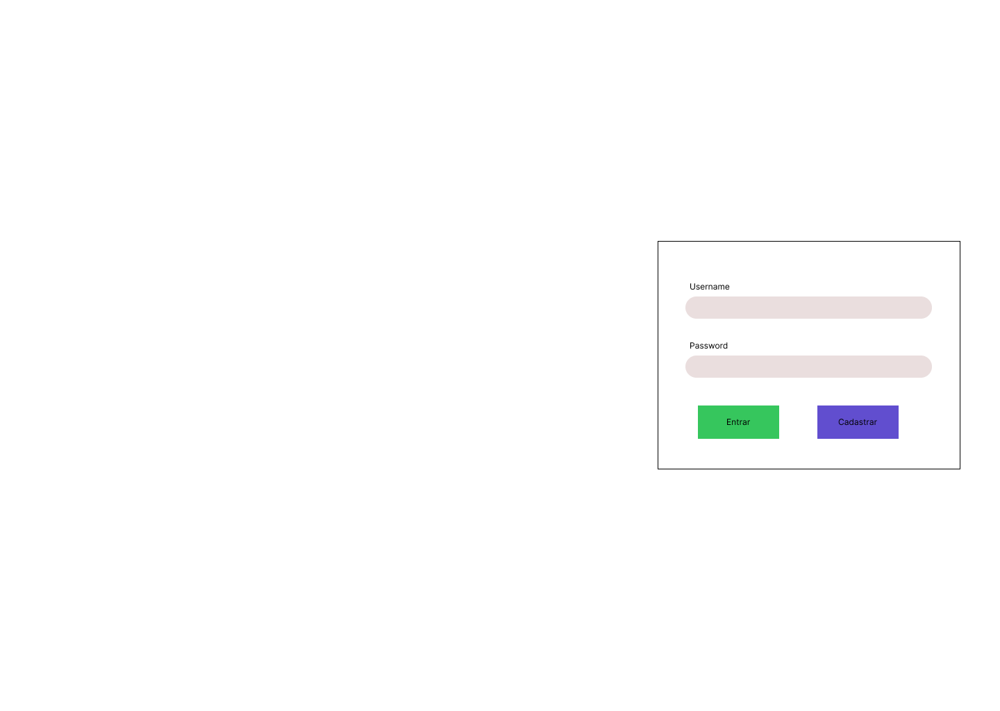
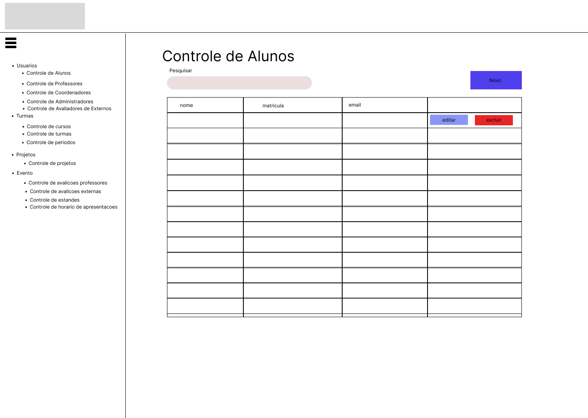
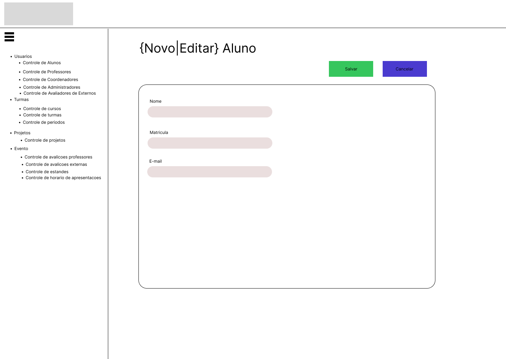
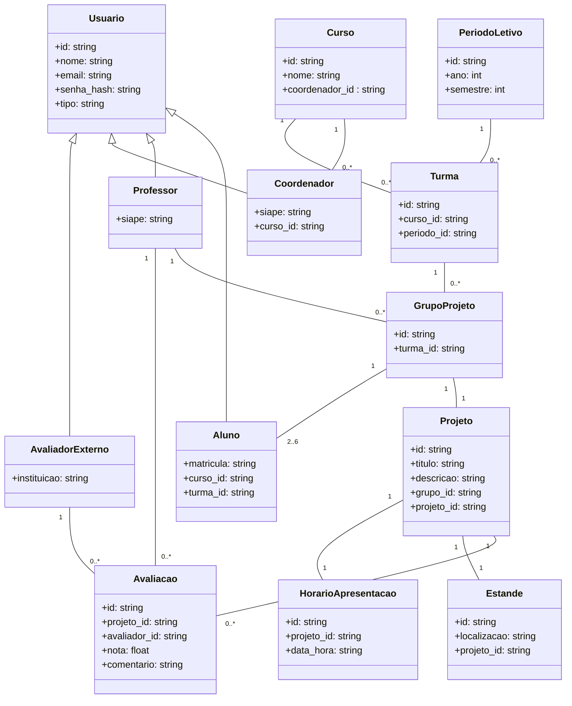

# Produto 1
Projeto de Desenvolvimento de Dashboard Analítico
## Objetivo
- Exercitar os seguintes conceitos trabalhados na disciplina:
- Estruturação de interfaces com HTML e CSS;
- Programação com JavaScript (manipulação de DOM e eventos);
- Implementação de operações CRUD no frontend;
- Persistência de dados utilizando localStorage;
- Organização de código e trabalho colaborativo com GitHub.
- O foco principal do trabalho é avaliar a capacidade de construção de interfaces funcionais e manipulação de dados no lado do cliente.
## Enunciado
O trabalho será desenvolvido em grupos de no mínimo 2 e no máximo 4 estudantes.
Desenvolver um sistema web de gestão de projetos escolares, operando exclusivamente no frontend, utilizando HTML, CSS e JavaScript.
O sistema deverá utilizar localStorage para persistência dos dados, não sendo necessário o desenvolvimento de backend.
O grupo deverá implementar um módulo do sistema, conforme divisão definida pelo professor.
Cada módulo deverá conter:
Tela de listagem de dados;
Formulário de cadastro e edição;
Funcionalidades de criação, leitura, atualização e remoção (CRUD).
O sistema deverá simular controle de usuários e permissões, não sendo exigida autenticação real.
## Atividades
O grupo deverá:
Desenvolver interfaces utilizando HTML e CSS;
Implementar lógica de manipulação de dados com JavaScript;
Criar funcionalidades completas de CRUD;
Utilizar localStorage para armazenamento dos dados;
Garantir validação básica dos dados nos formulários;
Criar um repositório no GitHub para armazenar o projeto;
Trabalhar de forma colaborativa, garantindo contribuição de todos os integrantes.
## Requisitos Técnicos
Utilização obrigatória de JavaScript puro (Vanilla JS);
Não é permitido o uso de frameworks ou bibliotecas externas;
Persistência obrigatória com localStorage;
Código deve estar organizado e legível;
O sistema deve ser funcional e navegável.
Observações Importantes
O controle de acesso é apenas conceitual (simulado);
Não é necessário desenvolver backend;
O projeto deverá estar disponível no repositório oficial da disciplina;
Todos os integrantes devem contribuir com o código.

## Tarefas 

TASK 1 - Tela de Login e Menu
Descrição: Criar tela de login com campos email e senha. Validar formato de email (conter "@" e domínio) e senha mínima de 6 caracteres. Verificar credenciais no localStorage e exibir erro se inválidas. Ao autenticar, armazenar sessão no localStorage e redirecionar ao menu. Impedir acesso às demais telas sem login. O menu exibe nome do usuário, botão logout (limpa sessão) e links para todos os cadastros, restritos conforme tipo de usuário.

TASK 2 - CRUD de Cursos, Períodos Letivos e Turmas
Descrição: Criar listagem e formulário de cadastro/edição de Cursos, Períodos Letivos e Turmas. Curso: campos nome (obrigatório, mínimo 3 caracteres, único) e coordenador_id (seleção); impedir exclusão se houver turmas vinculadas. Período Letivo: campos ano (numérico, 2020-2030) e semestre (1 ou 2), combinação ano+semestre única; impedir exclusão se houver turmas vinculadas. Turma: campos curso_id e periodo_id (seleções obrigatórias), combinação curso+período única; impedir exclusão se houver grupos vinculados. Todos com busca, confirmação na exclusão, id único e persistência no localStorage.

TASK 3 - CRUD de Alunos
Descrição: Criar listagem e formulário de cadastro/edição de Alunos. Listagem exibe nome, email, matrícula, curso e turma, com busca por nome ou matrícula. Formulário com campos: nome (obrigatório, mínimo 3 caracteres), email (obrigatório, formato válido, único), senha (obrigatório no cadastro, mínimo 6 caracteres), matrícula (obrigatória, única), curso_id (seleção obrigatória) e turma_id (seleção obrigatória, filtrada pelo curso selecionado). Tipo definido automaticamente como "aluno". Na exclusão, impedir se o aluno estiver vinculado a grupo de projeto. Confirmação antes de excluir, id único e persistência no localStorage.

TASK 4 - CRUD de Professores e Coordenadores
Descrição: Criar listagem e formulário de cadastro/edição de Professores e Coordenadores. Campos comuns: nome (obrigatório, mínimo 3), email (obrigatório, formato válido, único), senha (obrigatório no cadastro, mínimo 6) e siape (obrigatório, único). Coordenador inclui campo adicional curso_id (seleção obrigatória). Tipo definido automaticamente ("professor" ou "coordenador"). Na exclusão de professor, impedir se for orientador de grupo ou possuir avaliações. Na exclusão de coordenador, impedir se estiver vinculado a curso. Busca por nome ou SIAPE, confirmação na exclusão, id único e persistência no localStorage.

TASK 5 - CRUD de Avaliadores Externos e Avaliações
Descrição: Criar listagem e formulário de cadastro/edição de Avaliadores Externos e Avaliações. Avaliador Externo: campos nome (mínimo 3), email (formato válido, único), senha (mínimo 6) e instituição (mínimo 3); tipo definido como "avaliador_externo"; impedir exclusão se houver avaliações vinculadas. Avaliação: campos projeto_id (seleção obrigatória), avaliador_id (seleção de professor ou avaliador externo), nota (numérico 0-10, uma casa decimal) e comentário (opcional, máximo 500 caracteres); validar que o mesmo avaliador não avalie o mesmo projeto mais de uma vez. Busca, confirmação na exclusão, id único e persistência no localStorage.

TASK 6 - CRUD de Grupos de Projeto
Descrição: Criar listagem e formulário de cadastro/edição de Grupos de Projeto. Listagem exibe turma (curso+período), professor orientador e quantidade de alunos, com filtro por turma. Formulário com campos turma_id (seleção obrigatória), professor orientador (seleção de professor cadastrado) e alunos (seleção múltipla de alunos da turma escolhida). Validar que o grupo possui entre 2 e 6 alunos. Impedir que um aluno pertença a mais de um grupo na mesma turma. Na exclusão, impedir se houver projeto vinculado. Confirmação antes de excluir, id único e persistência no localStorage.

TASK 7 - CRUD de Projetos
Descrição: Criar listagem e formulário de cadastro/edição de Projetos. Listagem exibe título, grupo vinculado e descrição resumida (50 caracteres), com busca por título. Formulário com campos título (obrigatório, mínimo 5, único), descrição (obrigatório, mínimo 10) e grupo_id (seleção de grupo que ainda não possui projeto). Validar que cada grupo possui no máximo um projeto. Na exclusão, impedir se houver avaliações, estande ou horário de apresentação vinculados. Confirmação antes de excluir, id único e persistência no localStorage.

TASK 8 - CRUD de Estandes e Horários de Apresentação
Descrição: Criar listagem e formulário de cadastro/edição de Estandes e Horários de Apresentação. Estande: campos localização (obrigatório, mínimo 3 caracteres, única) e projeto_id (seleção de projeto que ainda não possui estande); cada projeto possui no máximo um estande. Horário: campos data_hora (obrigatório, formato datetime, não permitir datas no passado) e projeto_id (seleção de projeto que ainda não possui horário); cada projeto possui no máximo um horário; validar que não há conflito de horário entre projetos. Busca, confirmação na exclusão, id único e persistência no localStorage.

# Helpers







# Comando para iniciar a branch do meu controle

``` bash
git clone https://github.com/ProjetoProfJames/front20261-produto1.git
git checkout -b squad-00-task-00
git push origin squad-00-task-00
```
```
git clone [ulr do projeto]
git checkout -b [branc-grupo]
git checkout -b [branc-grupo-tarefa]
git add [arqivo alterado]
git commit -m "[comentario da alteracao]"
git push origin [branc-grupo-tarefa]
```

# Comando para enviar uma alteracao de projeto
``` bash
git add <nome do arquivo alterado> <outro arquivo>
git commit -m "<a mensagem do seu commit>"
git push origin squad-00-task-00
```

#Deiagrama de Classes


